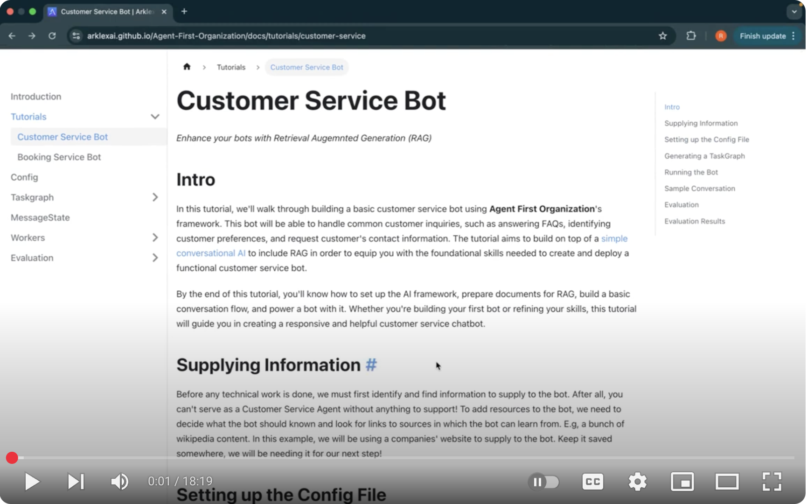

# Agent First Organization


[](https://pypi.org/project/arklex)


Arklex Agent First Organization provides a framework for developing **AI Agents** to complete complex tasks powered by LLMs. The framework is designed to be modular and extensible, allowing developers to customize workers/tools that can interact with each other in a variety of ways under the supervision of the orchestrator managed by *Taskgraph*. 

## 📖 Documentation

Please see [here](https://arklexai.github.io/Agent-First-Organization/) for full documentation, which includes:
* [Introduction](https://arklexai.github.io/Agent-First-Organization/docs/intro): Overview of the Arklex AI agent framework and structure of the docs.
* [Tutorials](https://arklexai.github.io/Agent-First-Organization/docs/tutorials/intro): If you're looking to build a customer service agent or booking service bot, check out our tutorials. This is the best place to get started. 


## 💻 Installation 
```
pip install arklex
```

⚙️ Preparation

📂 Set Up Environment

  * Add the API key for the provider(s) you wish to use to your `.env` file:
    - **OpenAI**: 
    `OPENAI_API_KEY`
    - **Gemini/Google**: 
    `GEMINI_API_KEY,GOOGLE_API_KEY
    `
    - **Anthropic**:
    `ANTHROPIC_API_KEY
    `
  * Set `LANGCHAIN_TRACING_V2` to `true` use `LangSmith` Trace [Optional] (In order to use Trace function, you need to create a LangChain account from [here](https://langchain.com/) and create a API key in the settings.)
  * Set `LANGCHAIN_API_KEY` to `.env` if enable Trace.
  * If you are going to use the `SearchWorker`, you need to set up the `TAVILY_API_KEY` to `.env` as well. (In order to use Tavily, you need to create a Tavily account from [here](https://docs.tavily.com/) and create a API key by click [Get API Key](https://app.tavily.com/home).)

Create a config file, similar to the `project/examples/customer_service_config.json`
The config file should contain the following fields:
  * `role (Required)`: The general role of the chatbot you want to create
  * `user_objective (Required)`: The user's goal that you want the chatbot to achieve. Describe in third person.
  * `builder_objective (Optional)`: The additional target you want the chatbot to achieve beyond the user's goal. Describe in third person.
  * `domain (Optional)`: The domain of the company that you want to create the chatbot for
  * `intro (Required)`: The introduction of the company that you want to create the chatbot for or the summary of the tasks that the chatbot need to handle
  * `task_docs (Optional, Dict)`: The documents resources for the taskgraph generation to create the chatbot. The dictionary should contain the following fields:
      * `source (Required)`: The source url that you want the chatbot to refer to
      * `desc (Optional)` : Short description of the source and how it is used
      * `num (Optional)`: The number of websites that you want the chatbot to refer to for the source, defaults to one (only the url page)
  * `rag_docs (Optional, Dict)`: The documents resources for the rag component of chatbot when running chatbot. The dictionary should contain the following fields:
      * `source (Required)`: The source url that you want the chatbot to refer to
      * `desc (Optional)` : Short description of the source and how it is used
      * `num (Optional)`: The number of websites that you want the chatbot to refer to for the source, defaults to one (only the url page)
  * `tasks (Optional, List(Dict))`: The pre-defined list of tasks that the chatbot need to handle. If empty, the system will generate the tasks and the steps to complete the tasks based on the role, objective, domain, intro and docs fields. The more information you provide in the fields, the more accurate the tasks and steps will be generated. If you provide the tasks, it should contain the following fields:
      * `task_name (Required, Str)`: The task that the chatbot need to handle
      * `steps (Required, List(Str))`: The steps to complete the task
  * `workers (Required, List(Dict))`: The workers pre-defined under arklex/env/workers folder that you want to use for the chatbot. Each worker will be defined as a class decorated with @register_worker. Please refer to the arklex/env/workers/message_worker.py for an example. The field required for each worker object is:
      * `id (Required, uuid)`: The unique id for the worker
      * `name (Required, Str)`: The WorkerClassName. Such as `MessageWorker`
      * `path (Required, Str)`: The file path of the worker start from the arklex/env/workers folder. Such as `message_worker.py`.
  * `tools (Optional, List(Dict))`: The tools (e.g. APIs, function, etc.) pre-defined under arklex/env/tools folder that you want to use for the chatbot. Each tool will be defined as a function decorated with @register_tool. The decorator includes the **description** - the purpose of the function, **slots** - the arguments needed for the function, **outputs** - expected result of the function. For more details, please refer to the arklex/env/tools/shopify/find_user_id_by_email.py as an example. The field required for each tool object is:
      * `id (Required, uuid)`: The unique id for the worker
      * `name (Required, Str)`: The tool function name. Such as `find_user_id_by_email`.
      * `path (Required, Str)`: The file path of the worker start from the arklex/env/tools folder. Such as `shopify/find_user_id_by_email.py`.
      * `fixed_args (Optional, Dict)`: All the must and deterministic arguments for the tool function, such as credentials or already known argument during development. It should be a dictionary. Such as `{"token": "<access_token>", "shop_url": "<url>", "api_version": "<version>"}`

## 🛠️ Build A Demo Customer Service Agent

Watch the tutorial on [YouTube](https://youtu.be/y1P2Ethvy0I) to learn how to build a customer service AI agent with Arklex.AI in just 20 minutes.

<a href="https://youtu.be/y1P2Ethvy0I" target="_blank">
  
</a>

> **:bulb:** The following `--output-dir`, `--input-dir` and `--documents_dir` can be the same directory to save the generated files and the chatbot will use the generated files to run. E.g `--output-dir ./example/customer_service`. The following commands take *customer_service* chatbot as an example.

**📊 1. Create Taskgraph and Initialize Worker**
```
python create.py --config ./examples/customer_service_config.json --output-dir ./examples/customer_service
```

* Fields:
  * `--config`: The path to the config file
  * `--output-dir`: The directory to save the generated files
  * `--model`: The openai model type used to generate the taskgraph. The default is `gpt-4o`. You could change it to other models like `gpt-4o-mini`.

* It will first generate a task plan based on the config file and you could modify it in an interactive way from the command line. Made the necessary changes and press `s` to save the task plan under `output-dir` folder and continue the task graph generation process.
* Then it will generate the task graph based on the task plan and save it under `output-dir` folder as well.
* It will also initialize the Workers listed in the config file to prepare the documents needed by each worker. The function `init_worker(args)` is customizable based on the workers you defined. Currently, it will automatically build the `RAGWorker` and the `DataBaseWorker` by using the function `build_rag()` and `build_database()` respectively. The needed documents will be saved under the `output-dir` folder.


**💬 2. Start Chatting**
```
python run.py --input-dir ./examples/customer_service
```

* Fields:
  * `--input-dir`: The directory that contains the generated files
  * `--llm_provider`: The LLM provider you wish to use. 
    - Options: `openai` (default), `gemini`, `anthropic`
  * `--model`: The model type used to generate bot response. Default is `gpt-4o`. 
    - You can change this to other models like:
      - `gpt-4o-mini`
      - `gemini-2.0-flash-exp`
      - `claude-3-haiku-20240307`
  

* It will first automatically start the nluapi and slotapi services through `start_apis()` function. By default, this will start the `NLUModelAPI ` and `SlotFillModelAPI` services defined under `./arklex/orchestrator/NLU/api.py` file. You could customize the function based on the nlu and slot models you trained.
* Then it will start the agent and you could chat with the agent


**🔍 3. Evaluation**

  * First, create api for the previous chatbot you built. It will start an api on the default port 8000.
    ```
    python model_api.py  --input-dir ./examples/customer_service
    ```

    * Fields:
      * `--input-dir`: The directory that contains the generated files
      * `--model`: The openai model type used to generate bot response. Default is `gpt-4o`. You could change it to other models like `gpt-4o-mini`.
      * `--port`: The port number to start the api. Default is 8000.

  * Then, start the evaluation process: 
    ```
    python eval.py \
    --model_api http://127.0.0.1:8000/eval/chat \
    --config ./examples/customer_service_config.json \
    --documents_dir ./examples/customer_service \
    --output-dir ./examples/customer_service
    ```
    * Fields:
      * `--model_api`: The api url that you created in the previous step
      * `--config`: The path to the config file
      * `--documents_dir`: The directory that contains the generated files
      * `--output-dir`: The directory to save the evaluation results
      * `--num_convos`: Number of synthetic conversations to simulate. Default is 5.
      * `--num_goals`: Number of goals/tasks to simulate. Default is 5.
      * `--max_turns`: Maximum number of turns per conversation. Default is 5.
      * `--model`: The openai model type used to synthesize user's utterance. Default is `gpt-4o`. You could change it to other models like `gpt-4o-mini`.
  
    📄 For more details, check out the [Evaluation README](https://github.com/arklexai/Agent-First-Organization/blob/main/arklex/evaluation/README.md).