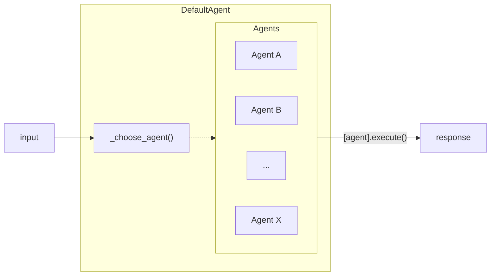

# DefaultAgent
## Introduction

DefaultAgent a special type of agents that acts as a wildcard and as a backup in case the taskgraph does not assign any other agent to it. The DefaultAgent allows for execution-side agent selection and allows more flexibility and generality with the agent choice.

# Implementation

Selected by the [TaskGraph](../Taskgraph/intro.md) when it fails to find a fitting agent during the TaskGraph generation, DefaultAgent looks through the possible agents and selects an appropriate on on execution by allowing the LLM to best match the task with a list of bots and their descriptions.

### Class Attributes
`description`: *"Default Agent if there is no specific agent for the user's query"*\
`llm`: LLM model to be used for path generation\
`base_choice`: "MessageAgent"\
`available_agents`: List of agents available to choose from\

#### Visualization

## Instantiation
On instantiation, unlike most agents, no StatesGraph are created as DefaultAgent will directly call the selected agent without changing the input.

```py
    def __init__(self):
        super().__init__()
        self.llm = ChatOpenAI(model=MODEL["model_type_or_path"], timeout=30000)
        self.base_choice = "MessageAgent"
        self.available_agents = {name: AGENT_REGISTRY[name].description for name in AGENT_REGISTRY.keys() if name != "DefaultAgent"}
```

## Execution
### Choosing the Agent

Passing into a dictionary of agent name and the description of the possible candidate agents, the LLM has 2 tries to select a fitting candidate agent otherwise it defaults to the base choice agent which is the [MessageAgent](./MessageAgent.mdx). 

<details>
<summary> choose_agent_prompt </summary>
```
choose_agent_prompt = """You are an assistant that has access to the following set of tools. Here are the names and descriptions for each tool:
{agents_info}
Based on the conversation history, choose the appropriate agent to respond to the user's message.
Conversation:
{formatted_chat}
The response must be the name of one of the agents ({agents_name}).
Answer:
```
</details>


## Execution

After selecting the agent, DefaultAgent's `execute()` merely returns the invoked return of the selected agent by returning the chosen agent's `execute()`.

---
## Code


```py
class DefaultAgent(BaseAgent):

    description = "Default Agent if there is no specific agent for the user's query"

    def __init__(self):
        super().__init__()
        self.llm = ChatOpenAI(model=MODEL["model_type_or_path"], timeout=30000)
        self.base_choice = "MessageAgent"
        self.available_agents = {name: AGENT_REGISTRY[name].description for name in AGENT_REGISTRY.keys() if name != "DefaultAgent"}

    def _choose_agent(self, state: MessageState, limit=2):
        user_message = state['user_message']
        agents_info = "\n".join([f"{name}: {description}" for name, description in self.available_agents.items()])
        agents_name = ", ".join(self.available_agents.keys())

        prompt = PromptTemplate.from_template(choose_agent_prompt)
        input_prompt = prompt.invoke({"message": user_message.message, "formatted_chat": user_message.history, "agents_info": agents_info, "agents_name": agents_name})
        chunked_prompt = chunk_string(input_prompt.text, tokenizer=MODEL["tokenizer"], max_length=MODEL["context"])
        logger.info(f"Chunked prompt for deciding default agent: {chunked_prompt}")
        final_chain = self.llm | StrOutputParser()
        while limit > 0:
            answer = final_chain.invoke(chunked_prompt)
            for agent_name in self.available_agents.keys():
                if agent_name in answer:
                    logger.info(f"Chosen agent: {agent_name}")
                    return agent_name
            limit -= 1
        logger.info(f"Base agent chosen: {self.base_choice}")
        return self.base_choice
    
    def execute(self, msg_state: MessageState):
        chose_agent = self._choose_agent(msg_state)
        agent = AGENT_REGISTRY[chose_agent]()
        result = agent.execute(msg_state)
        return result
```