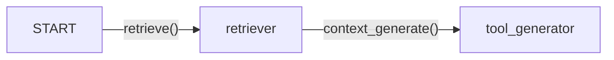

# RAGAgent
## Introduction

RAGAgents are also one of the main building blocks and supports the bot in Retrieval Augmented Generation (RAG) to retrieve the relevant information and compose a response based on that.

# Implementation

RAGAgent provides one of the critical fuction for nearly all bots.

This agents consists of 3 nodes: a start node, a retriever node, a tool generator node connected together in a piepline. Given a question, the retriever node retrieves the relevant information through applying FAISS on the RAG documents listed in the configs, then it pipes to the tool generator node which uses it to construct an answer to the given question.

### Class Attributes
`description`: *"Answer the user's questions based on the company's internal documentations (unstructured text data), such as the policies, FAQs, and product information"*\
`llm`: LLM model to be used for path generation\
`action_graph`: LangGraph StateGraph

#### Visualization

## Instantiation
On instantiation, the LLM model and the StateGraph is created with the nodes and edges declaration.

```py
def __init__(self):
        super().__init__()
        self.action_graph = self._create_action_graph()
        self.llm = ChatOpenAI(model=MODEL["model_type_or_path"], timeout=30000)
     
def _create_action_graph(self):
    workflow = StateGraph(MessageState)
    # Add nodes for each agent
    workflow.add_node("retriever", RetrieveEngine.retrieve)
    workflow.add_node("tool_generator", ToolGenerator.context_generate)
    # Add edges
    workflow.add_edge(START, "retriever")
    workflow.add_edge("retriever", "tool_generator")
    return workflow
```

## Execution
#### 0. Calling `execute()`
The `execute()` method is called which invokes the StateGraph on the MessageState and runs generator on the input MessageState. It returns the invoked StateGraph which allows it to be nested into other agents.

```py
def execute(self, msg_state: MessageState):
    graph = self.action_graph.compile()
    result = graph.invoke(msg_state)
    return result
```

### Retrieval

```py
def retrieve(state: MessageState):
    # get the input message
    user_message = state['user_message']

    # Search for the relevant documents
    docs = FaissRetriever.load_docs(database_path=os.environ.get("DATA_DIR"))
    retrieved_text = docs.search(user_message.history)

    state["message_flow"] = retrieved_text
    return state
```

### Context Generation

#### 1. Unpack MessageState 
First, the first stage unpacks the [MessageState](../MessageState.md) object.
```py
def generator(self, state: MessageState) -> MessageState:
    # get the input message
    user_message = state['user_message']
    orchestrator_message = state['orchestrator_message']
    message_flow = state.get('response', "") + "\n" + state.get("message_flow", "")

    # get the orchestrator message content
    orch_msg_content = orchestrator_message.message
    orch_msg_attr = orchestrator_message.attribute
    direct_response = orch_msg_attr.get('direct_response', False)
```

#### 2. Check for predefined automatic response
Next, it then checks if it has a predefined static response to respond at the node that should be done without generation.
```py
    if direct_response:
        return orch_msg_content
```

3. #### Generate Response
Then, it checks if an `orchestrator_message`(`node['attribute']['value']` in [TaskGraph](../Taskgraph/intro.md)) exists. `orchestrator_message` holds the pre-generated text for which the response would be built off on. Otherwise, it will generate from scratch
    ex. 

```py
    if message_flow and message_flow != "\n":
        prompt = PromptTemplate.from_template(message_flow_generator_prompt)
        input_prompt = prompt.invoke({"sys_instruct": state["sys_instruct"], "message": orch_msg_content, "formatted_chat": user_message.history, "initial_response": message_flow})
    else:
        prompt = PromptTemplate.from_template(message_generator_prompt)
        input_prompt = prompt.invoke({"sys_instruct": state["sys_instruct"], "message": orch_msg_content, "formatted_chat": user_message.history})
```

4. #### Connect to the LangChain
Lastly, it generates and processes the text into a string output and returns the updated MessageState.
```py
    logger.info(f"Prompt: {input_prompt.text}")
    chunked_prompt = chunk_string(input_prompt.text, tokenizer=MODEL["tokenizer"], max_length=MODEL["context"])
    final_chain = self.llm | StrOutputParser()
    answer = final_chain.invoke(chunked_prompt)

    state["message_flow"] = ""
    state["response"] = answer
    return state
```

---
## Code

```py
class RAGAgent(BaseAgent):

    description = "Answer the user's questions based on the company's internal documentations (unstructured text data), such as the policies, FAQs, and product information"

    def __init__(self):
        super().__init__()
        self.action_graph = self._create_action_graph()
        self.llm = ChatOpenAI(model=MODEL["model_type_or_path"], timeout=30000)
     
    def _create_action_graph(self):
        workflow = StateGraph(MessageState)
        # Add nodes for each agent
        workflow.add_node("retriever", RetrieveEngine.retrieve)
        workflow.add_node("tool_generator", ToolGenerator.context_generate)
        # Add edges
        workflow.add_edge(START, "retriever")
        workflow.add_edge("retriever", "tool_generator")
        return workflow

    def execute(self, msg_state: MessageState):
        graph = self.action_graph.compile()
        result = graph.invoke(msg_state)
        return result
```