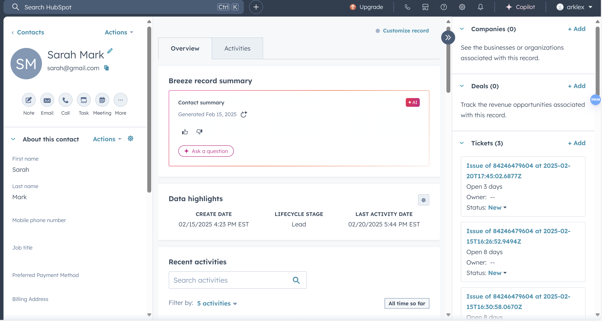
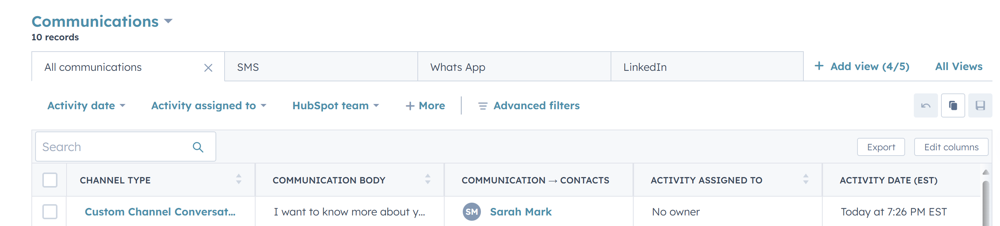
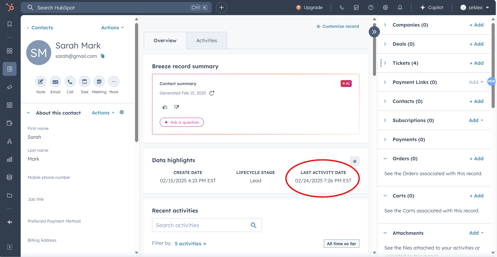
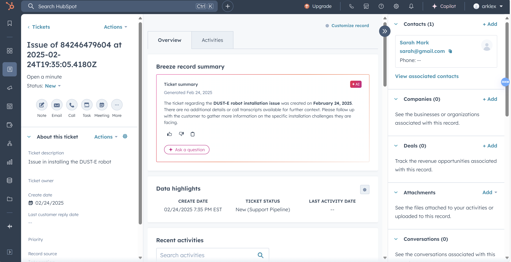

# Hubspot
## Introduction
HubSpot is a platform that connects your marketing, sales, and services tools to a unified **CRM** database. 
In this framework, the feature of the Hubspot is integrated for users to better manage the relationship between customers.

## Setup
Setting up the private app
* Login to [Hubspot](https://app.hubspot.com/login) and then go to ⚙ (Settings icon) on the top right
* On the left navbar, go to **Integrations** > **Private Apps**
* Create a new private app 
* Give a name for the new private app ("agent-integration"), upload a logo, and give some descriptions if you want
* Go to scopes to add the following necessary scopes:
  * crm.lists.read
  * crm.lists.write
  * crm.objects.contacts.read
  * crm.objects.contacts.write
  * crm.schemas.contacts.read
  * tickets
* The process of creating new private app is finished. The access token could be obtained.
* Adding relevant data for your company using several ways, such as **Import from files**, **Sync from files** and **Migrate from your data.**

## Implementation
### find_contact_by_email(email, chat, **kwargs): 
This function aims to find the existing customer by their emails and update the last activity date. 

Inputs:
* `email`: the email address of the customer (It should be noted that email address is also a unique identifier for each customer)
* `chat`: the chat content that customer communicates with the chatbot
* `**kwargs`: contains the **access token** for the hubspot private app

Output:
* `contact_info_properties`: id, email, first_name and last_name of the contact of the existing customer

There are several steps for the implementation of this function:
* Detect whether the customer is the existing one using `email`:
  
  ```python
  public_object_search_request = PublicObjectSearchRequest(
        filter_groups=[
            {
                "filters": [
                    {
                        "propertyName": "email",
                        "operator": "EQ",
                        "value": email
                    }
                ]
            }
        ]
    )

  try:
    contact_search_response = api_client.crm.contacts.search_api.do_search(public_object_search_request=public_object_search_request)
    logger.info("Found contact by email: {}".format(email))
    contact_search_response = contact_search_response.to_dict()
  ```

* If the user is not an existing customer, `USER_NOT_FOUND_ERROR` will be returned. If the user is the existing customer, the response of search_api is shown below. 
The structure of a contact is demonstrated inside the `results` field.
  ```
  {'paging': None,
   'results': [{'archived': False,
                'archived_at': None,
                'created_at': datetime.datetime(2025, 2, 15, 21, 23, 10, 453000, tzinfo=tzutc()),
                'id': '84246479604',
                'properties': {'createdate': '2025-02-15T21:23:10.453Z',
                               'email': 'sarah@gmail.com',
                               'firstname': 'Sarah',
                               'hs_object_id': '84246479604',
                               'lastmodifieddate': '2025-02-23T22:15:05.802Z',
                               'lastname': 'Mark'},
                'properties_with_history': None,
                'updated_at': datetime.datetime(2025, 2, 23, 22, 15, 5, 802000, tzinfo=tzutc())}],
   'total': 1}
  ```
  
  In Hubspot the detailed information of the **contact** is looked like below:
  
  

* Then a **communication** object will be created, whose content is `chat`:
  
  ```python
  if contact_search_response['total'] == 1:
    contact_id = contact_search_response['results'][0]['id']
    communication_data = SimplePublicObjectInputForCreate(
        properties = {
            "hs_communication_channel_type": "CUSTOM_CHANNEL_CONVERSATION",
            "hs_communication_body": chat,
            "hs_communication_logged_from": "CRM",
            "hs_timestamp": datetime.now(timezone.utc).isoformat(),
            }
    )
    contact_info_properties = {
        'id': contact_id,
        'email': email,
        'first_name': contact_search_response['results'][0]['properties'].get('firstname'),
        'last_name': contact_search_response['results'][0]['properties'].get('lastname')
    }
    try:
        communication_creation_response = api_client.crm.objects.communications.basic_api.create(communication_data)
        communication_creation_response = communication_creation_response.to_dict()
  ```
  
  The structure of the **communication** object is shown below:
  ```
   {'archived': False,
   'archived_at': None,
   'created_at': datetime.datetime(2025, 2, 25, 0, 26, 48, 751000, tzinfo=tzutc()),
   'id': '81116227304',
   'properties': {'hs_body_preview': 'I want to know more about your product: '
                                     'Adam',
                  'hs_body_preview_html': '<html>\n'
                                          ' <head></head>\n'
                                          ' <body>\n'
                                          ' I want to know more about your '
                                          'product: Adam\n'
                                          ' </body>\n'
                                          '</html>',
                  'hs_body_preview_is_truncated': 'false',
                  'hs_communication_body': 'I want to know more about your '
                                           'product: Adam',
                  'hs_communication_channel_type': 'CUSTOM_CHANNEL_CONVERSATION',
                  'hs_communication_logged_from': 'CRM',
                  'hs_createdate': '2025-02-25T00:26:48.751Z',
                  'hs_lastmodifieddate': '2025-02-25T00:26:48.751Z',
                  'hs_object_id': '81116227304',
                  'hs_object_source': 'INTEGRATION',
                  'hs_object_source_id': '8190657',
                  'hs_object_source_label': 'INTEGRATION',
                  'hs_timestamp': '2025-02-25T00:26:48.370Z'},
   'properties_with_history': None,
   'updated_at': datetime.datetime(2025, 2, 25, 0, 26, 48, 751000, tzinfo=tzutc())}
  ```
  
  On Hubspot you could see a **communication** object is correspondingly created:
  
  

* Associate the **created communication** with the **contact**. 
After associating, the `'lastmodifieddate'` and `'updated_at'` of contact will be updated accordingly.:
  
  ```python
  communication_id = communication_creation_response['id']
  association_spec = [
    AssociationSpec(
        association_category="HUBSPOT_DEFINED",
        association_type_id=82
    )
  ]
  try:
    association_creation_response = api_client.crm.associations.v4.basic_api.create(
        object_type="contact",
        object_id=contact_id,
        to_object_type="communication",
        to_object_id=communication_id,
        association_spec=association_spec
    )
  ```
  
  The structure of the association object is shown below:
  ```
  {'from_object_id': '84246479604',
   'from_object_type_id': '0-1',
   'labels': [],
   'to_object_id': '81116227304',
   'to_object_type_id': '0-18'}
  ```
  At the same time, `Last Activity Date` on the **contact** information page is also updated as well:
  
  
  
  
### create_ticket(contact_information, issue, **kwargs): 
When users need technical support/repair service/exchange service, the function will be called. This function is used to create the ticket only for existing customers after calling `find_contact_by_email` function.

Inputs:
* `contact_information`: `id`, `email`, `first_name` and `last_name` of the contact of the existing customer returned from `find_contact_by_email`
* `issue`: the issue that the customer has for the product
* `**kwargs`: contains the **access token** for the hubspot private app

Output:
* `ticket_information`: The basic ticket information for the existing customer and the specific issue (ticket_id)

There are several steps for the implementation of this function:
* Create a **ticket** for the existing customer:
  
  ```python
  timestamp = datetime.now().strftime("%Y-%m-%dT%H:%M:%S.%fZ")[:-3] + "Z"
  subject_name = "Issue of " + contact_id + " at " + timestamp
  ticket_properties = {
        'hs_pipeline_stage': 1,
        'content': issue,
        'subject': subject_name
    }
  ticket_for_create = SimplePublicObjectInputForCreate(properties=ticket_properties)
  try:
    ticket_creation_response = api_client.crm.tickets.basic_api.create(simple_public_object_input_for_create=ticket_for_create)
    ticket_creation_response = ticket_creation_response.to_dict()
  ```

  The structure of the created **ticket** is like:
  ```
  {'archived': False,
   'archived_at': None,
   'created_at': datetime.datetime(2025, 2, 25, 0, 35, 5, 747000, tzinfo=tzutc()),
   'id': '33397362407',
   'properties': {'content': 'Issue in installing the DUST-E robot',
                  'createdate': '2025-02-25T00:35:05.747Z',
                  'hs_helpdesk_sort_timestamp': '2025-02-25T00:35:05.747Z',
                  'hs_is_visible_in_help_desk': 'true',
                  'hs_last_message_from_visitor': 'false',
                  'hs_lastmodifieddate': '2025-02-25T00:35:05.747Z',
                  'hs_num_associated_companies': '0',
                  'hs_num_associated_conversations': '0',
                  'hs_num_times_contacted': '0',
                  'hs_object_id': '33397362407',
                  'hs_object_source': 'INTEGRATION',
                  'hs_object_source_id': '8190657',
                  'hs_object_source_label': 'INTEGRATION',
                  'hs_pipeline': '0',
                  'hs_pipeline_stage': '1',
                  'hs_ticket_id': '33397362407',
                  'num_notes': '0',
                  'subject': 'Issue of 84246479604 at 2025-02-24T19:35:05.4180Z'},
   'properties_with_history': None,
   'updated_at': datetime.datetime(2025, 2, 25, 0, 35, 5, 747000, tzinfo=tzutc())}
  ```
  
  On Hubspot, you could see the detailed information of a **ticket**:

  


* Associate the created **ticket** with the **contact**. It should be noted that `'lastmodifieddate'` and `'updated_at'` of contact will be updated after logging a ticket
  (On Hubspot, `Last Activity Date` of the **contact** is also updated:
  
  ```python
  ticket_id = ticket_creation_response['id']
  association_spec = [
    AssociationSpec(
        association_category="HUBSPOT_DEFINED",
        association_type_id=15
        )
  ]
  ticket_information = {
    'id': ticket_id
  }
  try:
    association_creation_response = api_client.crm.associations.v4.basic_api.create(
        object_type="contact",
        object_id=contact_id,
        to_object_type="ticket",
        to_object_id=ticket_id,
        association_spec=association_spec
    )
  ```

## Taskgraph
**Fields**:
* `nodes`: The nodes in the TaskGraph, each node contains the worker/tool name, task, and the directed attribute.
* `edges`: The edges in the TaskGraph, each edge contains the intent, weight, pred, definition, and sample_utterances.
The edge defines the connection between two nodes
* Fields in the config file: role, user_objective, builder_objective, domain, intro, task_docs, rag_docs, tasks, workers, tools
* `nluapi`: It will automatically add the default NLU api which use the `NLUOpenAIAPI` service defined under `./arklex/orchestrator/NLU/api.py` file. If you want to customize the NLU api, you can change the `nluapi` field to your own NLU api url.
* `slotfillapi`: It will automatically add the default SlotFill api which use the `SlotFillOpenAIAPI` service defined under `./arklex/orchestrator/NLU/api.py` file. If you want to customize the SlotFill api, you can change the `slotfillapi` field to your own SlotFill api url.

In the **Hubspot Integration**, there are two intents for users communicating the chatbot:
* When users have **questions** about the product, the chatbot will firstly ask for users' email to detect 
whether they are existing customers. At the same time, it will update the contact's last activity date if the user is an existing customer.
Then it will use `FaissRAGWorker` to generate answer for user's question. So the basic flow for this case is: `start_node -> search_customer -> FaissRAGWorker`
* When users need **technical support/repair service/exchange service** about the product, the chatbot will firstly ask for users' email to detect 
whether they are existing customers. At the same time, it will update the contact's last activity date if the user is an existing customer.
Then it will move to create a ticket for the corresponding issue and head it to the technician support team. 
So the basic flow for this case is: `start_node -> search_customer -> create_ticket`

So the taskgraph to handle these two cases is shown below:
```json
{
  "nodes": [
    [
      "0",
      {
        "resource": {
          "id": "be303c9a-a902-4de9-bbb2-61343e59e888",
          "name": "MessageWorker"
        },
        "attribute": {
          "value": "Hello! Welcome to Richtech. How can I assist you today?",
          "task": "start message",
          "directed": false
        },
        "limit": 1,
        "type": "start"
      }
    ],
    [
      "1",
      {
        "resource": {
          "id": "ddbe6adc-cd0e-40bc-8a95-91cb69ed807b",
          "name": "search_customer"
        },
        "attribute": {
          "value": "",
          "task": "Detect whether this is the existing customer from our hubspot platform",
          "directed": false
        },
        "limit": 1
      }
    ],
    [
      "2",
      {
        "resource": {
          "id": "aa8dd20d-fda7-475b-91ce-8c5fc356a2b7",
          "name": "create_ticket"
        },
        "attribute": {
          "value": "",
          "task": "create the ticket for the existing customer",
          "directed": false
        },
        "limit": 1
      }
    ],
    [
      "4",
      {
        "resource": {
          "id": "ddbe6adc-cd0e-40bc-8a95-91cb69ed807b",
          "name": "search_customer"
        },
        "attribute": {
          "value": "",
          "task": "Detect whether this is the existing customer from our hubspot platform",
          "directed": false
        },
        "limit": 1
      }
    ],
    [
      "3",
      {
        "resource": {
          "id": "40f05456-525c-4d9d-ac37-54482d6b220b",
          "name": "FaissRAGWorker"
        },
        "attribute": {
          "value": "",
          "task": "Retrieve information from the documentations to answer customer question",
          "directed": false
        },
        "limit": 1
      }
    ]
  ],
  "edges": [
    [
      "0",
      "1",
      {
        "intent": "User has questions about the product",
        "attribute": {
          "weight": 1,
          "pred": true,
          "definition": "",
          "sample_utterances": []
        }
      }
    ],
    [
      "0",
      "4",
      {
        "intent": "User need technical support/User need repair service / User need exchange service",
        "attribute": {
          "weight": 1,
          "pred": true,
          "definition": "",
          "sample_utterances": []
        }
      }
    ],
    [
      "4",
      "2",
      {
        "intent": "none",
        "attribute": {
          "weight": 1,
          "pred": true,
          "definition": "",
          "sample_utterances": []
        }
      }
    ],
    [
      "1",
      "3",
      {
        "intent": "none",
        "attribute": {
          "weight": 1,
          "pred": true,
          "definition": "",
          "sample_utterances": []
        }
      }
    ]
  ],
  "role": "customer service assistant",
  "user_objective": "The customer service assistant helps users with customer service inquiries. It can provide information about products, services, and policies, as well as help users resolve issues and complete transactions.",
  "builder_objective": "The customer service assistant helps to request customer's contact information.",
  "domain": "robotics and automation",
  "intro": "Richtech Robotics's headquarter is in Las Vegas; the other office is in Austin. Richtech Robotics provide worker robots (ADAM, ARM, ACE), delivery robots (Matradee, Matradee X, Matradee L, Richie), cleaning robots (DUST-E SX, DUST-E MX) and multipurpose robots (skylark). Their products are intended for business purposes, but not for home purpose; the ADAM robot is available for purchase and rental for multiple purposes. This robot bartender makes tea, coffee and cocktails. Richtech Robotics also operate the world's first robot milk tea shop, ClouTea, in Las Vegas (www.cloutea.com), where all milk tea beverages are prepared by the ADAM robot. The delivery time will be one month for the delivery robot, 2 weeks for standard ADAM, and two months for commercial cleaning robot. ",
  "task_docs": [
  ],
  "rag_docs": [
  ],
  "tasks": [],
  "tools": [
    {
      "id": "ddbe6adc-cd0e-40bc-8a95-91cb69ed807b",
      "name": "find_contact_by_email",
      "path": "hubspot.find_contact_by_email",
      "fixed_args": { "access_token": "<access-token>" }
    },
    {
      "id": "aa8dd20d-fda7-475b-91ce-8c5fc356a2b7",
      "name": "create_ticket",
      "path": "hubspot.create_ticket",
      "fixed_args": { "access_token": "<access-token>" }
    }
  ],
  "workers": [
    {
      "id": "be303c9a-a902-4de9-bbb2-61343e59e888",
      "name": "MessageWorker",
      "path": "message_worker.py"
    },
    {
      "id": "40f05456-525c-4d9d-ac37-54482d6b220b",
      "name": "FaissRAGWorker",
      "path": "faiss_rag_worker.py"
    }
  ],
  "nluapi": "",
  "slotfillapi": ""
}
```

## Running the chatbot
When the taskgraph is generated, you could use the following command to run the chatbot (suppose the `./examples/hubspot` contains the taskgraph):
`python run.py --input-dir ./examples/hubspot`

## Sample conversation
(1) 1st case (When user has questions about the product)
```
Bot: Hello! Welcome to Richtech. How can I assist you today?
Customer: I want to know more about your product: Adam
Bot: "Thanks for your interest in the ADAM robot! Could you please provide your email or phone number so we can send you more detailed information?"
Customer: "sarah@gmail.com"
Bot: The ADAM robot is a versatile worker robot available for both purchase and rental. It can serve multiple purposes, including making tea, coffee, and cocktails. It's perfect for businesses looking to enhance their service offerings with a robotic bartender. If you have any specific questions or need further details, feel free to ask!"
Customer: How much is the Adam?
Bot: The pricing for the ADAM robot can vary based on the specific configuration and requirements for your business. To provide you with the most accurate pricing, could you please share more details about your intended use or any specific features you are interested in? Alternatively, I can have a sales representative contact you with detailed pricing information.
```
(2) 2nd case (When user needs technical support/repair service/exchange service)
```
Bot: Hello! Welcome to Richtech. How can I assist you today?
Customer: I have a issue in installing the DUST-E robot
Bot: Thank you for reaching out about the issue with installing the DUST-E robot. To assist you further, could you please provide your email or phone number? This will help us get in touch with you and offer more detailed support.
Customer: "sarah@gmail.com"
Bot: Thank you, Sarah. I've created a support ticket for your issue with installing the DUST-E robot. Our team will reach out to you shortly to assist you further. Your ticket ID is 20616280431. If you have any more questions or need further assistance, feel free to ask!
```


