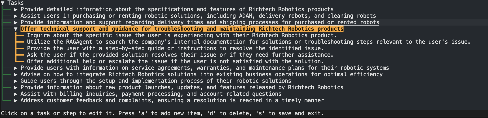
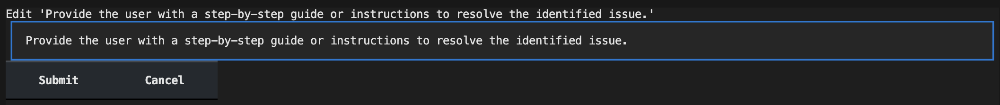

# Generation
The **TaskGraph** is generated from the **Config** file. The **Config** file is a JSON document that contains the role, user objective, builder objective, domain, intro, task_docs, rag_docs, tasks, and workers. The **Generator** reads the **Config** file and creates a series of tasks that are matched with the appropriate workers.

The whole process is divided into the following steps:
1. **Generate high-level tasks**: The **Generator** reads the **Config** file, and make use of the role, user objective, domain, intro, task_docs to come up with the high-level tasks that bot need to handle.
2. **Generate task planning**: For each high-level task, if the task is not actionable to be handled by the provided Worker, then the **Generator** will further break down the tasks into multiple steps or instructions that needed to complete the whole task. 
3. **Interactive with builder**: The **Generator** will interact with the builder to get the feedback on the generated tasks and steps through interactive command line tool - [textual](https://textual.textualize.io/). The builder can add, delete, modify the generated tasks and steps to improve the quality of *Taskgraph*.
4. **Fine-tune the steps based-on builder's objective**: The generated *Task planning* will be fine-tuned based on the builder's objective, which can be some strategies or hidden objectives.
5. **Match tasks with workers**: Finally, the finetuned task planning will be matched with the appropriate workers that are provided in the **Config** file. If the workers are not provided, the steps will be assigned to the default workers.


## Task planning
Here is an example of interactive panel for creating customer service assistant. The builder can add, delete, modify and save the task planning.

> :bulb: **Notice**:
> * The 1st level content is the tasks this Worker will handle, the 2nd level content is the steps to complete each task.
> * You can use the arrow keys to navigate the tasks and steps, and press `a` to add a new task or step, `d` to delete the task or step, `s` to save this.
> * When you click on the task or step, you can modify the content and press `submit` to save the changes or `cancel` to disgard the change. The following image is the example of modifying panel.




## Task Graph
Here is an exmaple of the generated TaskGraph for the customer service assistant.
```json
{
    "nodes": [
        [
            "0",
            {
                "name": "MessageWorker",
                "attribute": {
                    "value": "Hello! I'm your Customer Service Assistant. How may I assist you with your inquiries today? Whether you need information about our products, services, or policies, or need help resolving an issue or completing a transaction, I'm here to help.",
                    "task": "start message",
                    "directed": false
                },
                "limit": 1,
                "type": "start"
            }
        ],
        [
            "1",
            {
                "name": "RAGWorker",
                "attribute": {
                    "value": "Here are the detailed specifications and features of our Richtech Robotics products: [insert specifications and features here]. If you have any more questions, feel free to ask!",
                    "task": "Provide detailed information about the specifications and features of Richtech Robotics products",
                    "directed": false
                },
                "limit": 1
            }
        ],
        ...
    ],
    "edges": [
        [
            "0",
            "1",
            {
                "intent": "User wants information about product specifications and features",
                "attribute": {
                    "weight": 1,
                    "pred": true,
                    "definition": "",
                    "sample_utterances": []
                }
            }
        ],
        [
            "0",
            "2",
            {
                "intent": "User needs assistance with product purchasing or rental",
                "attribute": {
                    "weight": 1,
                    "pred": true,
                    "definition": "",
                    "sample_utterances": []
                }
            }
        ],
        ...
    ],
    "role": "customer service assistant",
    "user_objective": "The customer service assistant helps users with customer service inquiries. It can provide information about products, services, and policies, as well as help users resolve issues and complete transactions.",
    "builder_objective": "The customer service assistant helps to request customer's contact information.",
    "domain": "robotics and automation",
    "intro": "Richtech Robotics's headquarter is in Las Vegas; the other office is in Austin. Richtech Robotics provide worker robots (ADAM, ARM, ACE), delivery robots (Matradee, Matradee X, Matradee L, Richie), cleaning robots (DUST-E SX, DUST-E MX) and multipurpose robots (skylark). Their products are intended for business purposes, but not for home purpose; the ADAM robot is available for purchase and rental for multiple purposes. This robot bartender makes tea, coffee and cocktails. Richtech Robotics also operate the world's first robot milk tea shop, ClouTea, in Las Vegas (www.cloutea.com), where all milk tea beverages are prepared by the ADAM robot. The delivery time will be one month for the delivery robot, 2 weeks for standard ADAM, and two months for commercial cleaning robot. ",
    "task_docs": [
        {
            "source": "https://www.richtechrobotics.com/",
            "num": 20
        }
    ],
    "rag_docs": [
        {
            "source": "https://www.richtechrobotics.com/",
            "num": 20
        }
    ],
    "tasks": [],
    "workers": [
        "RAGAWorker",
        "RagMsgWorker",
        "MessageWorker",
        "SearchWorker",
        "DefaultWorker"
    ],
    "nluapi": "http://localhost:55135/nlu/predict",
    "slotfillapi": "http://localhost:55135/slotfill/predict"
}
```
**Fields:**
* `nodes`: The nodes in the TaskGraph, each node contains the worker name, task, and the directed attribute.
* `edges`: The edges in the TaskGraph, each edge contains the intent, weight, pred, definition, and sample_utterances.
* fileds in the config file: role, user_objective, builder_objective, domain, intro, task_docs, rag_docs, tasks, workers
* nluapi: It will automatically add the default NLU api which use the `NLUModelAPI ` service defined under `./agentorg/orchestrator/NLU/api.py` file. If you want to customize the NLU api, you can change the `nluapi` field to your own NLU api url.
* slotfillapi: It will automatically add the default SlotFill api which use the `SlotFillModelAPI` service defined under `./agentorg/orchestrator/NLU/api.py` file. If you want to customize the SlotFill api, you can change the `slotfillapi` field to your own SlotFill api url.