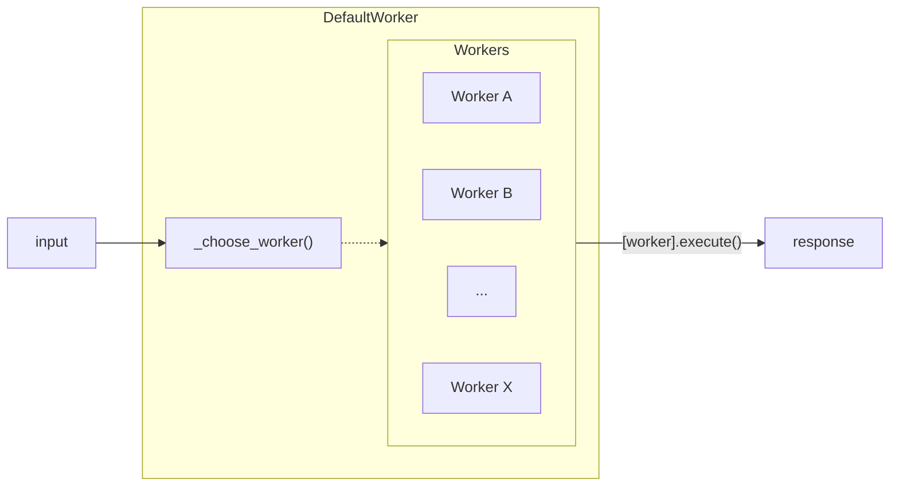

# DefaultWorker
## Introduction

DefaultWorker a special type of workers that acts as a wildcard and as a backup in case the taskgraph does not assign any other worker to it. The DefaultWorker allows for execution-side worker selection and allows more flexibility and generality with the worker choice.

# Implementation

Selected by the [TaskGraph](../Taskgraph/intro.md) when it fails to find a fitting worker during the TaskGraph generation, DefaultWorker looks through the possible workers and selects an appropriate on on execution by allowing the LLM to best match the task with a list of bots and their descriptions.

### Class Attributes
`description`: *"Default Worker if there is no specific worker for the user's query"*\
`llm`: LLM model to be used for path generation\
`base_choice`: "MessageWorker"\
`available_workers`: List of workers available to choose from\

#### Visualization

## Instantiation
On instantiation, unlike most workers, no StatesGraph are created as DefaultWorker will directly call the selected worker without changing the input.

```py
def __init__(self):
    super().__init__()
    self.llm = ChatOpenAI(model=MODEL["model_type_or_path"], timeout=30000)
    self.base_choice = "MessageWorker"
    available_workers = os.getenv("AVAILABLE_WORKERS", "").split(",")
    self.available_workers = {name: WORKER_REGISTRY[name].description for name in available_workers if name != "DefaultWorker"}
```

## Execution
### Choosing the Worker

Passing into a dictionary of worker name and the description of the possible candidate workers, the LLM has 2 tries to select a fitting candidate worker otherwise it defaults to the base choice worker which is the [MessageWorker](./MessageWorker.mdx). 

<details>
<summary> choose_worker_prompt </summary>
```
choose_worker_prompt = """You are an assistant that has access to the following set of tools. Here are the names and descriptions for each tool:
{workers_info}
Based on the conversation history, choose the appropriate worker to respond to the user's message.
Conversation:
{formatted_chat}
The response must be the name of one of the workers ({workers_name}).
Answer:
```
</details>


## Execution

After selecting the worker, DefaultWorker's `execute()` merely returns the invoked return of the selected worker by returning the chosen worker's `execute()`.

---
## Code


```py
class DefaultWorker(BaseWorker):

    description = "Default worker decided by chat records if there is no specific worker for the user's query"

    def __init__(self):
        super().__init__()
        self.llm = ChatOpenAI(model=MODEL["model_type_or_path"], timeout=30000)
        self.base_choice = "MessageWorker"
        available_workers = os.getenv("AVAILABLE_WORKERS", "").split(",")
        self.available_workers = {name: WORKER_REGISTRY[name].description for name in available_workers if name != "DefaultWorker"}

    def _choose_worker(self, state: MessageState, limit=2):
        user_message = state['user_message']
        task = state["orchestrator_message"].attribute.get("task", "")
        workers_info = "\n".join([f"{name}: {description}" for name, description in self.available_workers.items()])
        workers_name = ", ".join(self.available_workers.keys())

        prompt = PromptTemplate.from_template(choose_worker_prompt)
        input_prompt = prompt.invoke({"message": user_message.message, "formatted_chat": user_message.history, "task": task, "workers_info": workers_info, "workers_name": workers_name})
        chunked_prompt = chunk_string(input_prompt.text, tokenizer=MODEL["tokenizer"], max_length=MODEL["context"])
        final_chain = self.llm | StrOutputParser()
        while limit > 0:
            answer = final_chain.invoke(chunked_prompt)
            for worker_name in self.available_workers.keys():
                if worker_name in answer:
                    logger.info(f"Chosen worker for the default worker: {worker_name}")
                    return worker_name
            limit -= 1
        logger.info(f"Base worker chosen for the default worker: {self.base_choice}")
        return self.base_choice
    
    def execute(self, msg_state: MessageState):
        chose_worker = self._choose_worker(msg_state)
        worker = WORKER_REGISTRY[chose_worker]()
        result = worker.execute(msg_state)
        return result
```