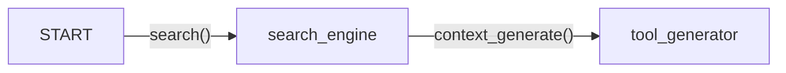

# SearchWorker

## Introduction

Search Workers retrieve real-time data from the web or databases, and generate coherent and user-specific responses. The searched results enable them to address complex and time-sensitive queries effectively by integrating up-to-date information with their foundational knowledge.


## Implementation
With a similar structrue to the [RAGWorker](./RAGWorker.mdx), instead of retrieving from local documents, it retrieves from the internet instead through Tavily's search engine API.

:::tip  Tavily API Integration 

You can get an API key by visiting [this site](https://python.langchain.com/docs/integrations/tools/tavily_search/#:~:text=key%20by%20visiting-,this%20site,-and%20creating%20an) and creating an account.
:::

### Class Attributes
`description`: *"Answer the user's questions based on search engine results"*\
`llm`: LLM model to be used for path generation\
`action_graph`: LangGraph StateGraph

#### Visualization

## Instantiation
On instantiation, the LLM model and the StateGraph is created with the nodes and edges declaration.

```py
def __init__(self):
        super().__init__()
        self.action_graph = self._create_action_graph()
        self.llm = ChatOpenAI(model=MODEL["model_type_or_path"], timeout=30000)

def _create_action_graph(self):
    workflow = StateGraph(MessageState)
    # Add nodes for each worker
    search_engine = SearchEngine()
    workflow.add_node("search_engine", search_engine.search)
    workflow.add_node("tool_generator", ToolGenerator.context_generate)
    # Add edges
    workflow.add_edge(START, "search_engine")
    workflow.add_edge("search_engine", "tool_generator")
    return workflow
```

## Execution
### Search Retrieval 

The `search_engine` node calls the `SearchEngine.retrieve` method which first converts the chat history dependent query to a independent query and runs it via the Tavily's search engine API. It returns the series of URL and its content as the context.

### Generation
The generation part is the exact same as [RAGWorker's generation](./RAGWorker.mdx#generation).


## Sample Conversation

```json title="searchworker_function_sample.json"
Bot: Hello! How can I help you today?
You: I want to know the latest gaming result of Formula 1.
Bot: The latest gaming result from Formula 1 is that Charles Leclerc won the United States Grand Prix, with Ferrari achieving a one-two finish. Max Verstappen finished behind the Ferrari drivers.
```

You can checkout the [LangSmith Trace](https://smith.langchain.com/public/f55696d8-310d-4060-a90c-d6fae0b6a254/r) for the execution process. The Search Worker first searches online resources relevant to the user's query and then generates the final response.

